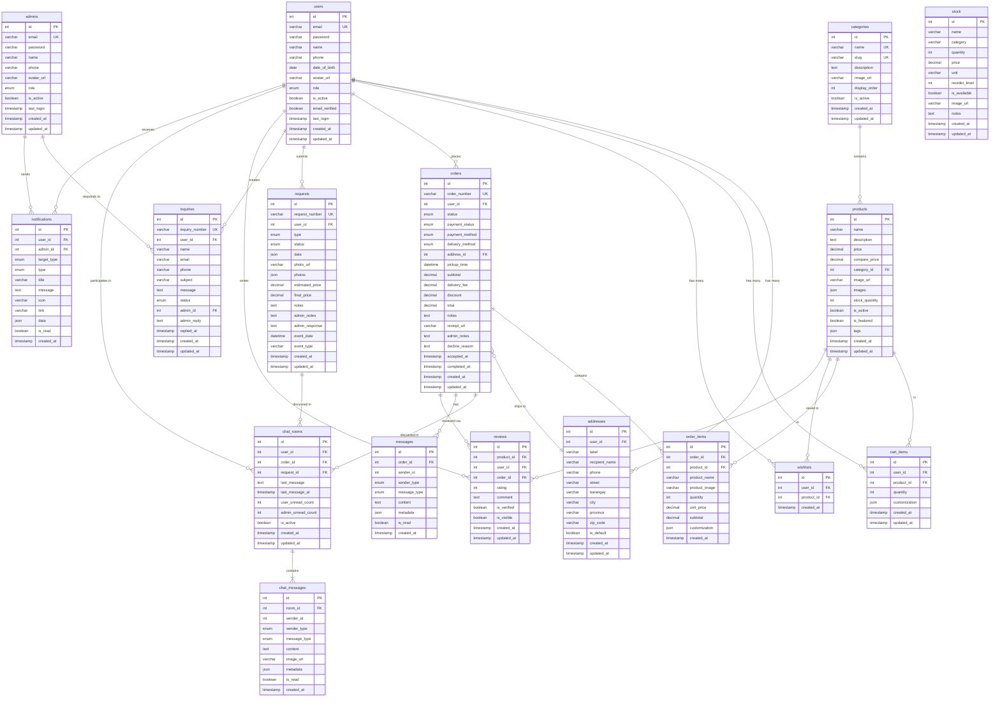
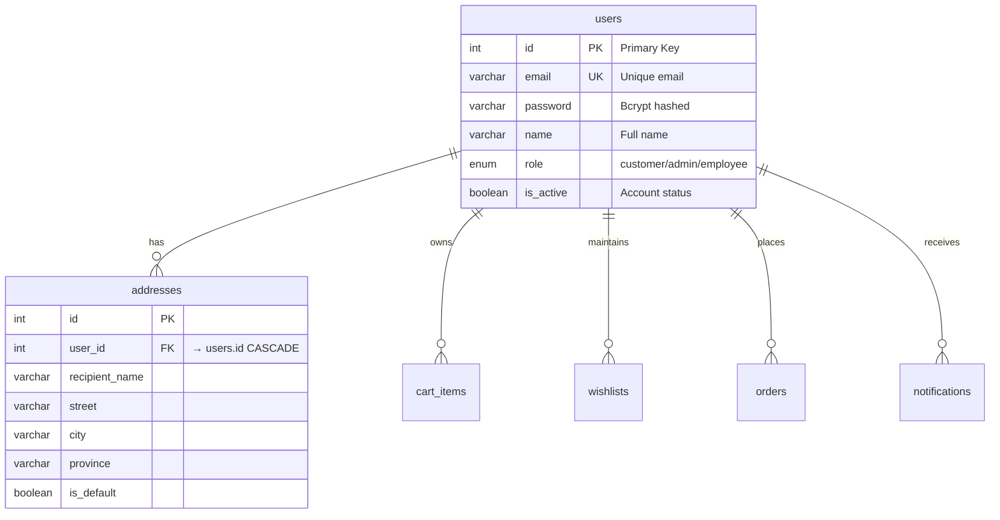
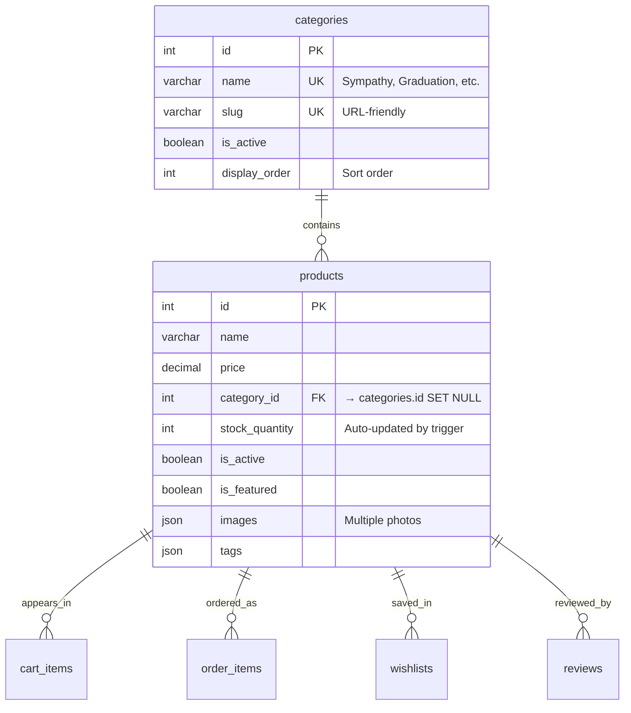
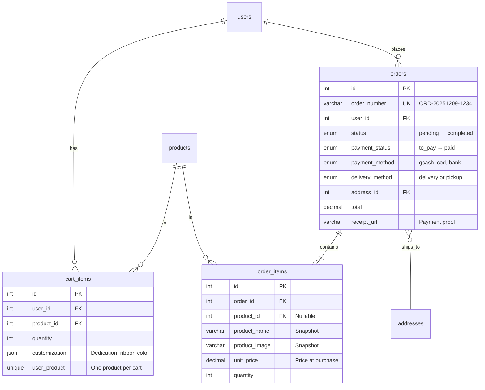
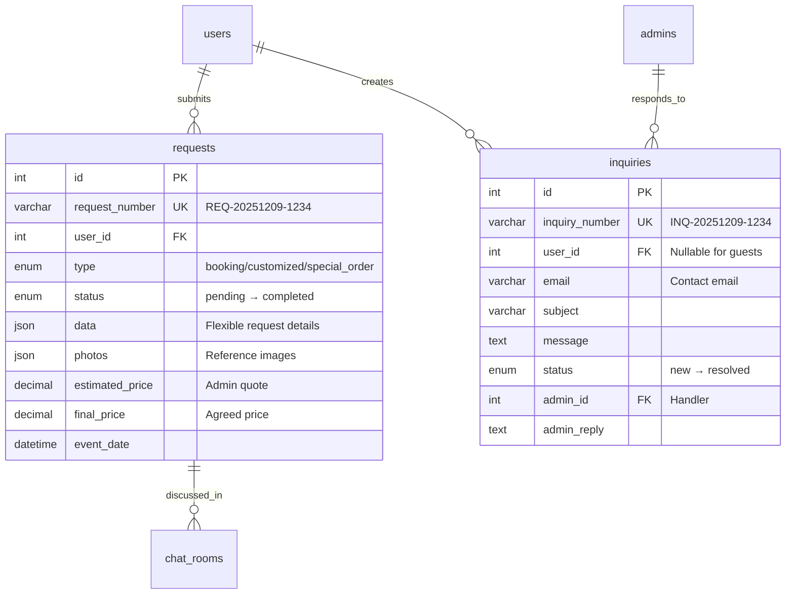
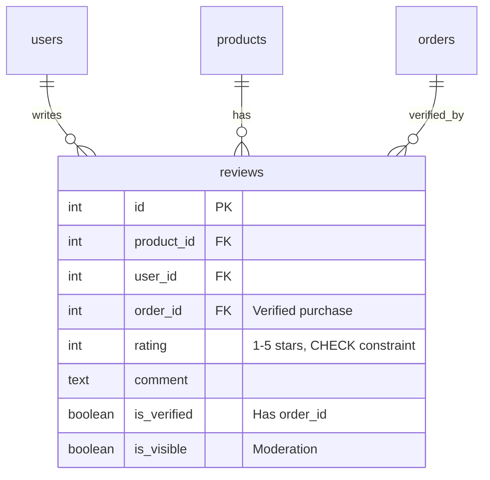
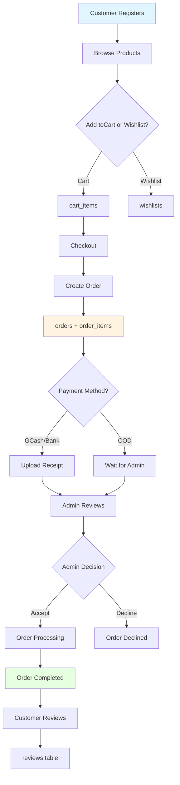
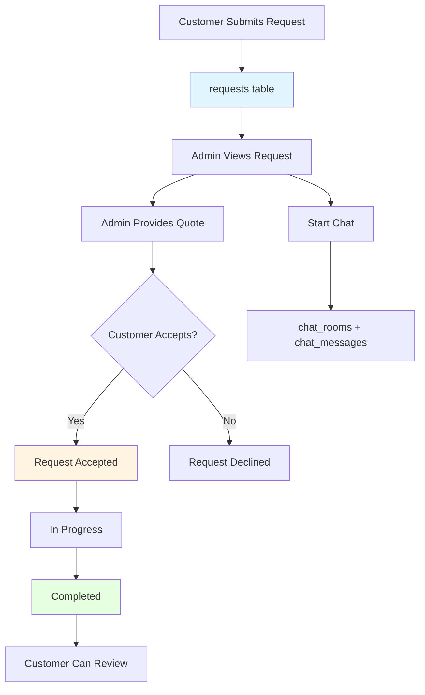
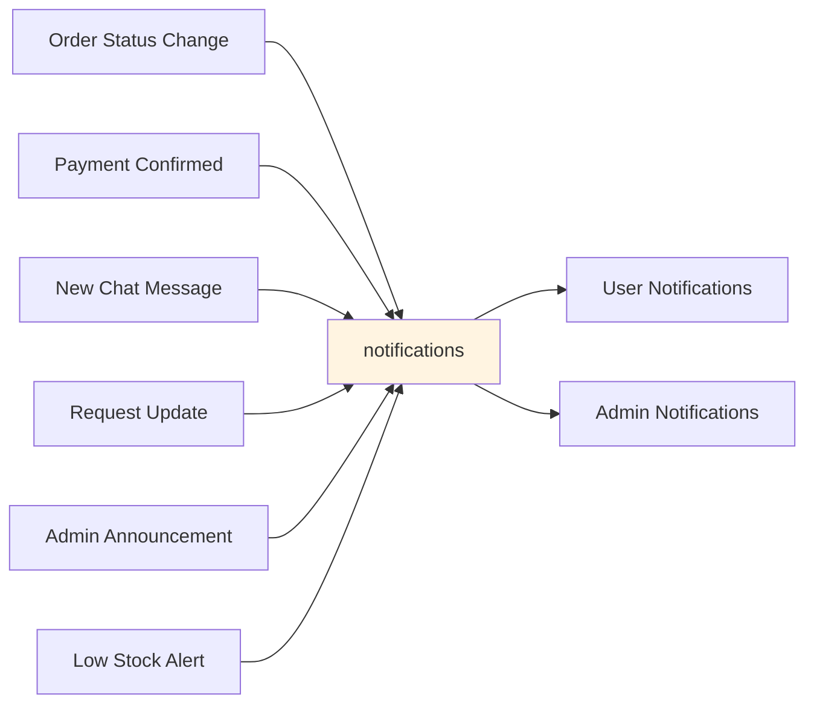

# FlowerForge Schema Documentation - Complete Overview

**Database**: flowerforge  
**Version**: 2.0  
**Engine**: MySQL 8.0+ (InnoD

B)  
**Tables**: 20  
**Stack**: Node.js + MySQL  
**Last Updated**: 2025-12-09

---

## Executive Summary

FlowerForge is a comprehensive e-commerce platform for a flower shop, supporting:
- Customer authentication and profiles
- Product catalog with categories
- Shopping cart and wishlist
- Order management with multiple fulfillment methods
- Custom requests and bookings
- Real-time chat communication
- Review and rating system
- Notifications system
- Inventory management
- Content management (About, Contact, Team)

## Table of Contents

- [Entity Relationship Diagram](#entity-relationship-diagram)
- [Database Overview](#database-overview)
- [Table Groups](#table-groups)
- [Detailed Entity Diagrams](#detailed-entity-diagrams)
- [Data Flow Diagrams](#data-flow-diagrams)
- [Schema Features](#schema-features)
- [Quick Reference](#quick-reference)

---

## Entity Relationship Diagram

### Complete System ERD



---

## Database Overview

### Table Groups

| Group | Tables | Purpose |
|-------|--------|---------|
| **Authentication** | users, admins | User and admin accounts |
| **User Data** | addresses | User delivery addresses |
| **Products** | categories, products | Product catalog |
| **Shopping** | cart_items, wishlists | Shopping cart and saved items |
| **Orders** | orders, order_items | Order management |
| **Requests** | requests, inquiries | Custom orders and support tickets |
| **Reviews** | reviews | Product ratings and feedback |
| **Communication** | chat_rooms, chat_messages, messages | Customer-admin messaging |
| **Notifications** | notifications | System notifications |
| **Inventory** | stock | Raw materials tracking |
| **Content** | about_content, team_members, contact_info | Website content |

### Statistics

- **Total Tables**: 20
- **Total Relationships**: 25+ foreign keys
- **Indexes**: 40+ (single + composite)
- **Triggers**: 4 (auto-generate numbers, update stock)
- **Views**: 3 (analytics)
- **Engine**: InnoDB (supports transactions, foreign keys)

---

## Detailed Entity Diagrams

### 1. User Authentication & Profile Flow



**Key Points**:
- User deletion cascades to all related data
- Email is unique and indexed
- Role determines access level
- Addresses support multiple per user with default flag

---

### 2. Product Catalog Structure



**Key Points**:
- Category deletion sets products.category_id to NULL (doesn't delete products)
- Stock quantity auto-decreases when orders placed (trigger)
- JSON fields for flexible data (images, tags)
- Featured products flag for homepage

---

### 3. Shopping Cart to Order Flow



**Checkout Flow**:
1. User adds products to `cart_items`
2. User proceeds to checkout
3. System creates `order` record
4. System copies cart items to `order_items` with snapshots
5. Trigger decreases product `stock_quantity`
6. Cart is cleared

**Why Snapshots**: Product names/images saved because products can be deleted or modified later

---

### 4. Custom Requests & Inquiries



**Use Cases**:
- **Requests**: Wedding bookings, custom arrangements, bulk orders
- **Inquiries**: General questions, delivery inquiries, product availability

---

### 5. Communication System

```mermaid
erDiagram
    users ||--o{ chat_rooms : participates_in
    chat_rooms ||--o{ chat_messages :contains
    chat_rooms }o--|| orders : about
    chat_rooms }o--|| requests : about
    orders ||--o{ messages : has_legacy
    
    chat_rooms {
        int id PK
        int user_id FK
        int order_id FK "Optional context"
        int request_id FK "Optional context"
        text last_message "Preview"
        timestamp last_message_at
        int user_unread_count
        int admin_unread_count
    }
    
    chat_messages {
        int id PK
        int room_id FK
        int sender_id "User or Admin ID"
        enum sender_type "customer/admin"
        enum message_type "text/image/payment_request"
        text content
        varchar image_url
        boolean is_read
    }
    
    messages {
        int id PK
        int order_id FK
        int sender_id
        enum sender_type
        text content
        note "Legacy system"
    }
```

**Modern Chat** (`chat_rooms` + `chat_messages`):
- Supports general chat and order/request-specific chat
- Unread message tracking for both sides
- Multiple message types (text, image, payment requests)

**Legacy Messages**:
- Order-specific only
- Maintained for backward compatibility

---

### 6. Reviews & Ratings



**Verified Purchases**: Reviews linked to `order_id` are marked `is_verified = true`

**Moderation**: `is_visible` allows admin to hide inappropriate reviews

---

## Data Flow Diagrams

### Customer Order Journey



### Custom Request Flow



### Notification Triggers



---

## Schema Features

### Auto-Generated Values

**Triggers for Number Generation**:

| Table | Trigger | Format | Example |
|-------|---------|--------|---------|
| orders | before_order_insert | ORD-YYYYMMDD-XXXX | ORD-20251209-1234 |
| requests | before_request_insert | REQ-YYYYMMDD-XXXX | REQ-20251209-5678 |
| inquiries | before_inquiry_insert | INQ-YYYYMMDD-XXXX | INQ-20251209-9012 |

**Stock Auto-Update**:
```sql
-- Trigger: after_order_item_insert
UPDATE products 
SET stock_quantity = stock_quantity - NEW.quantity
WHERE id = NEW.product_id;
```

### Analytical Views

#### 1. order_statistics
```sql
SELECT 
    COUNT(*) as total_orders,
    SUM(CASE WHEN status = 'pending' THEN 1 ELSE 0 END) as pending_orders,
    SUM(CASE WHEN status = 'completed' THEN 1 ELSE 0 END) as completed_orders,
    SUM(CASE WHEN payment_status = 'paid' THEN total ELSE 0 END) as total_revenue,
    AVG(total) as average_order_value
FROM orders;
```

#### 2. top_products
```sql
SELECT 
    p.id, p.name, c.name as category_name,
    SUM(oi.quantity) as total_sold,
    SUM(oi.subtotal) as total_revenue
FROM products p
LEFT JOIN order_items oi ON p.id = oi.product_id
LEFT JOIN categories c ON p.category_id = c.id
GROUP BY p.id
ORDER BY total_sold DESC;
```

#### 3. low_stock_items
```sql
SELECT id, name, category, quantity, reorder_level, unit
FROM stock
WHERE quantity <= reorder_level AND is_available = TRUE;
```

### Performance Indexes

**High-Traffic Queries**:

| Query Pattern | Index |
|--------------|-------|
| User login | `idx_email` on users |
| User orders | `idx_orders_user_status (user_id, status)` |
| Product listing | `idx_category_id`, `idx_is_active` |
| Order tracking | `idx_order_number` |
| Chat messages | `idx_chat_messages_room_created (room_id, created_at)` |
| Unread notifications | `idx_notifications_user_read (user_id, is_read)` |
| Recent orders | `idx_orders_created_status (created_at, status)` |

---

## Quick Reference

### Order Status Flow

```
pending → accepted → processing → ready_for_pickup/out_for_delivery → claimed/completed
                                                                      ↓
                                                                 cancelled/declined
```

### Payment Status Flow

```
to_pay → awaiting_confirmation → paid
                                   ↓
                              refunded
```

### Request Status Flow

```
pending → viewed → quoted → accepted → in_progress → completed
                                                        ↓
                                                   cancelled/declined
```

### Inquiry Status Flow

```
new → read → replied → resolved → closed
```

### Common Enums

| Field | Values |
|-------|--------|
| users.role | customer, admin, employee |
| admins.role | admin, employee |
| orders.status | pending, accepted, processing, ready_for_pickup, out_for_delivery, claimed, completed, cancelled, declined |
| orders.payment_status | to_pay, awaiting_confirmation, paid, refunded |
| orders.payment_method | cash_on_delivery, gcash, bank_transfer |
| orders.delivery_method | delivery, pickup |
| requests.type | booking, customized, special_order, inquiry |
| requests.status | pending, viewed, quoted, accepted, in_progress, completed, cancelled, declined |
| inquiries.status | new, read, replied, resolved, closed |
| notifications.type | order, payment, promotion, system, cancellation, chat, request |
| chat_messages.message_type | text, image, payment_request, payment_confirmation, system |

### Default Data

**Categories** (6):
- Sympathy
- Graduation
- All Souls Day
- Valentines
- Get Well Soon
- Mothers Day

**Admin Account**:
- Email: admin@flower.com
- Password: pa55w0rd

**Sample Stock Items** (8):
- Ribbons (Red Satin, Blue Organza, Pink)
- Wrappers (Gold Foil, Clear Cellophane, Brown Kraft)
- Flowers (Red Roses, White Lilies)

---

## Integration Points

### Node.js Backend

**Database Connection**:
```javascript
const mysql = require('mysql2/promise');
const pool = mysql.createPool({
  host: process.env.DB_HOST,
  user: process.env.DB_USER,
  password: process.env.DB_PASSWORD,
  database: 'flowerforge',
  waitForConnections: true,
  connectionLimit: 10,
  queueLimit: 0
});
```

**Authentication Middleware**:
- `auth` - Verifies JWT, sets `req.user`
- `adminAuth` - Requires admin or employee role
- `adminOnly` - Requires admin role only

### API Routes

| Endpoint | Table(s) | Purpose |
|----------|----------|---------|
| POST /api/auth/register | users | User registration |
| POST /api/auth/login | users | User login |
| GET /api/products | products, categories | List products |
| POST /api/cart/add | cart_items | Add to cart |
| POST /api/orders | orders, order_items | Create order |
| GET /api/orders/:id | orders, order_items, addresses | Get order details |
| POST /api/requests | requests | Submit custom request |
| POST /api/inquiries | inquiries | Submit inquiry |
| POST /api/reviews | reviews | Write review |
| GET /api/chat/rooms | chat_rooms | List chat rooms |
| GET /api/notifications | notifications | Get notifications |

---

## Maintenance & Monitoring

### Backup Strategy

**Daily**: Full database backup  
**Hourly**: Transaction log backup  
**Retention**: 30 days

### Monitoring Queries

**Check Low Stock**:
```sql
SELECT * FROM low_stock_items;
```

**Pending Orders Count**:
```sql
SELECT COUNT(*) FROM orders WHERE status = 'pending';
```

**Today's Revenue**:
```sql
SELECT SUM(total) FROM orders 
WHERE DATE(created_at) = CURDATE() 
AND payment_status = 'paid';
```

**Unread Inquiries**:
```sql
SELECT COUNT(*) FROM inquiries WHERE status = 'new';
```

---

## Future Enhancements

### Possible Additions

1. **Coupons/Discounts Table**
   - Promo codes
   - Discount percentages
   - Validity periods

2. **Loyalty Program**
   - Points system
   - Rewards redemption

3. **Product Variants**
   - Size options
   - Color variations

4. **Shipping Zones**
   - Location-based delivery fees
   - Delivery time estimates

5. **Order Tracking**
   - GPS tracking links
   - Status history log

6. **Product Bundles**
   - Package deals
   - Related products

---

## Related Documentation

- **[database-schema.md](./database-schema.md)** - Technical reference for all tables
- **[data-architecture.md](./data-architecture.md)** - User-centric data hierarchy
- **Backend API**: `backend/routes/` - Route implementations
- **Database Schema**: `backend/database/schema_complete.sql` - SQL source

---

**Maintained by**: FlowerForge Development Team  
**Technology Stack**: Node.js + Express + MySQL + JWT  
**Last Updated**: 2025-12-09  
**Schema Version**: 2.0
